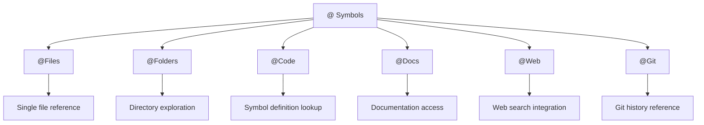
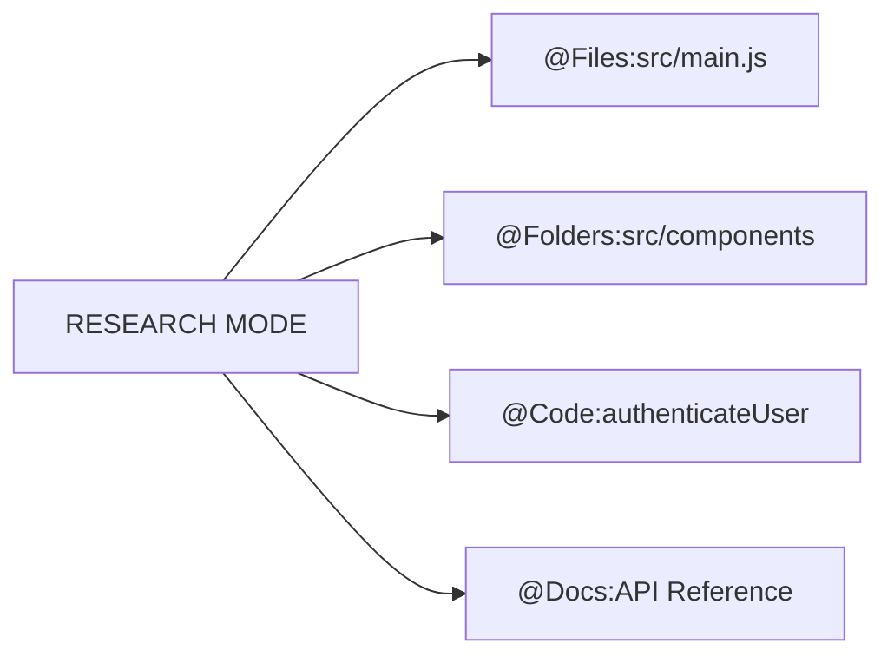
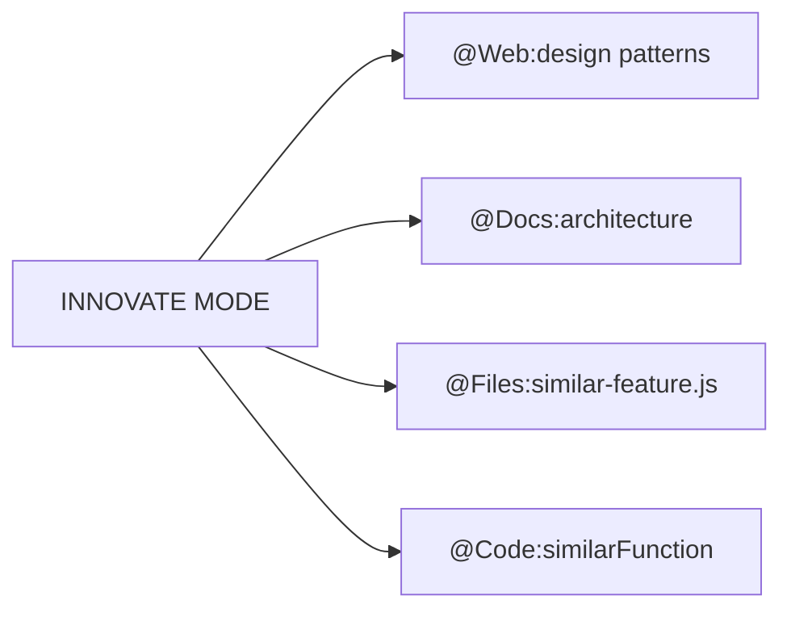
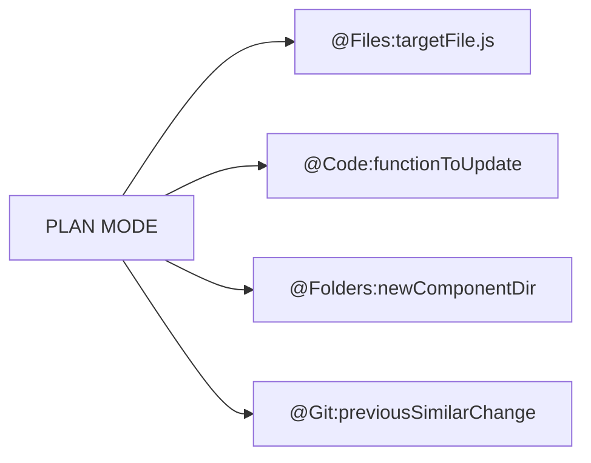
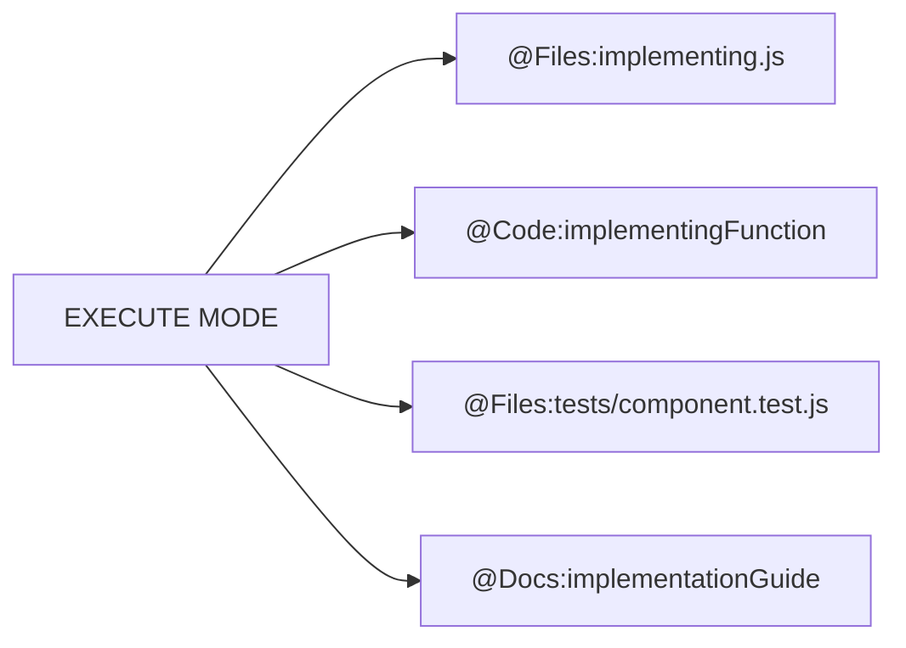
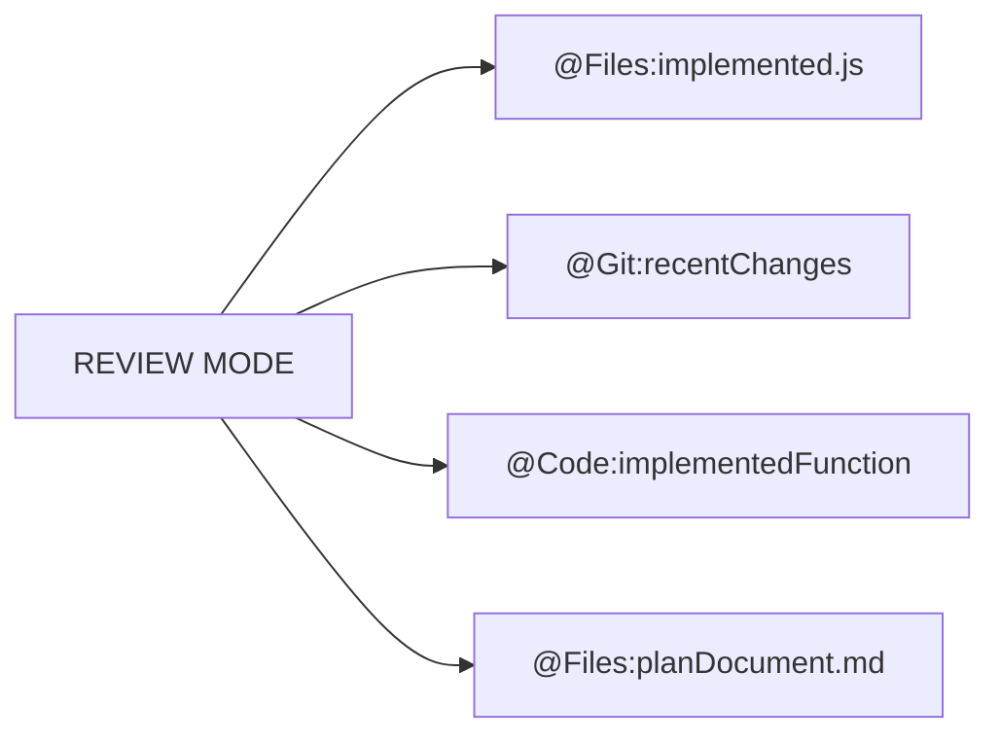

# CursorRIPER Framework - @ Symbol Guide
*Version: 1.0*

## Overview

This guide explains how to use Cursor IDE's @ symbol functionality within the CursorRIPER Framework to efficiently reference context during development.

## What Are @ Symbols?

In Cursor IDE, @ symbols provide a powerful way to reference specific context in conversations with the AI assistant:

- `@Files:path/to/file.js` - Reference specific files
- `@Folders:path/to/directory` - Reference entire folders
- `@Code:functionName` - Reference specific code symbols
- `@Docs:topic` - Access documentation
- `@Web:query` - Research external information
- `@Git:reference` - Access git history



## @ Symbols in the CursorRIPER Framework

The CursorRIPER Framework integrates @ symbols throughout its workflow to enhance context awareness while maintaining the structured RIPER approach.

### START Phase @ Symbol Usage

During project initialization, @ symbols help with:

1. **Requirements Gathering**
   - Research similar projects with `@Web:similar projects`
   - Reference requirements documents with `@Files:requirements.md`

2. **Technology Selection**
   - Research technology options with `@Web:technology comparisons`
   - Access documentation with `@Docs:framework`

3. **Architecture Definition**
   - Reference architectural patterns with `@Docs:architecture patterns`
   - Examine similar architectures with `@Folders:similar-project`

4. **Project Scaffolding**
   - Set up directory structures with `@Folders:src`
   - Create configuration files with `@Files:config.js`

5. **Environment Setup**
   - Configure environments with `@Files:.env.example`
   - Reference testing setups with `@Docs:testing`

6. **Memory Bank Initialization**
   - Document key project symbols in `@-symbol-registry.md`
   - Reference memory bank templates with `@Files:template.md`

### RIPER Workflow @ Symbol Usage

Each RIPER mode has specific @ symbol patterns that enhance its effectiveness:

#### RESEARCH Mode
- **Purpose**: Understanding existing code
- **Key Symbols**: `@Files`, `@Folders`, `@Code`, `@Docs`
- **Example**: `@Files:src/components/UserProfile.js`
- **Strategy**: Use symbols to explore the codebase systematically



#### INNOVATE Mode
- **Purpose**: Brainstorming approaches
- **Key Symbols**: `@Web`, `@Docs`, `@Files` (for similar implementations)
- **Example**: `@Web:latest authentication patterns`
- **Strategy**: Use symbols to research options and reference similar features



#### PLAN Mode
- **Purpose**: Creating detailed specifications
- **Key Symbols**: `@Files`, `@Code`, `@Folders` (targeted at implementation targets)
- **Example**: `@Files:src/services/apiService.js`
- **Strategy**: Use symbols to precisely specify implementation targets



#### EXECUTE Mode
- **Purpose**: Implementing the plan
- **Key Symbols**: `@Files`, `@Code` (implementation targets), `@Files` (test files)
- **Example**: `@Code:authenticateUser`
- **Strategy**: Reference symbols from the plan while implementing



#### REVIEW Mode
- **Purpose**: Validating implementation
- **Key Symbols**: `@Files`, `@Git`, `@Code` (implemented items)
- **Example**: `@Git:recent-changes`
- **Strategy**: Compare implemented code against the plan using symbols



## Project-Specific @ Symbol Registry

The CursorRIPER Framework includes a dedicated @ symbol registry in the memory bank:

- **Location**: `memory-bank/@-symbol-registry.md`
- **Purpose**: Documents all significant symbols for the project
- **Updates**: Maintained throughout development
- **Categories**: Files, Folders, Code, Documentation, Web, Git
- **Performance Notes**: Includes guidance on handling large files/directories

### Registry Example

```markdown
## Key Files
| Symbol | Description | Relevance |
|--------|-------------|-----------|
| `@Files:src/main.js` | Application entry point | HIGH |
| `@Files:src/components/Button.js` | Reusable button component | MEDIUM |
| `@Files:config/routes.js` | Application routing configuration | HIGH |
```

## Integrating @ Symbols with Memory Bank

The CursorRIPER Framework's memory bank files are enhanced with @ symbol references:

1. **projectbrief.md**: Core requirements with relevant research symbols
2. **systemPatterns.md**: Architecture documentation with component references
3. **techContext.md**: Technology stack with reference documentation symbols
4. **activeContext.md**: Current focus with active file/component symbols
5. **progress.md**: Implementation tracking with feature-specific symbols
6. **@-symbol-registry.md**: Comprehensive registry of all project symbols

### Cross-Referencing Example

```markdown
# Active Context: User Authentication
*Current RIPER Mode: EXECUTE*

## Current Focus
Implementing the user authentication flow.

## Key Context References
- `@Files:src/services/auth.js` - Authentication service implementation
- `@Code:validateUserCredentials` - Credential validation function
- `@Folders:src/components/auth` - Auth-related components
- `@Files:tests/services/auth.test.js` - Authentication tests
```

## Best Practices

### Symbol Discovery
1. **Explore Incrementally**: Start with high-level `@Folders` before drilling down
2. **Use Code Search**: Find relevant symbols with codebase search
3. **Document As You Go**: Add important symbols to the registry
4. **Link Related Symbols**: Group related symbols together

### Performance Optimization
1. **Avoid Large Files**: For files >1000 lines, use `@Code` instead of `@Files`
2. **Target Specific Subdirectories**: For large directories, target specific subdirectories
3. **Limit Concurrent Symbols**: Avoid referencing too many symbols simultaneously
4. **Use Progressive Loading**: Load context incrementally rather than all at once

### Memory Bank Integration
1. **Update Registry Regularly**: Keep the symbol registry current
2. **Link Symbols to Features**: Organize symbols by feature area
3. **Note Symbol Relevance**: Mark symbols as high/medium/low relevance
4. **Document Performance Considerations**: Note which symbols need special handling

### Mode-Specific Best Practices

1. **RESEARCH Mode**
   - Start with high-level folders before drilling down
   - Use `@Code` to zero in on specific functionality
   - Document important discoveries in the symbol registry
   - Create logical groupings of related symbols

2. **INNOVATE Mode**
   - Use `@Web` to research modern approaches
   - Reference similar implementations with `@Files`
   - Create inspirational collections of related symbols
   - Use `@Docs` to access best practices

3. **PLAN Mode**
   - Be extremely precise with file paths and function names
   - Map out all implementation targets with symbols
   - Include test file paths in your plan
   - Reference documentation for implementation guidance

4. **EXECUTE Mode**
   - Follow the exact symbols specified in the plan
   - Reference test files alongside implementation files
   - Use `@Docs` for implementation guidance
   - Track progress through symbol-based checklist items

5. **REVIEW Mode**
   - Compare implemented files with planned targets
   - Use `@Git` to review recent changes
   - Cross-reference with plan document
   - Note any deviations with precise symbol references

## @ Symbol Quick Reference

| Symbol Type | Format | Example | Best For |
|-------------|--------|---------|----------|
| Files | `@Files:path/to/file.ext` | `@Files:src/App.js` | Examining specific files |
| Folders | `@Folders:path/to/dir` | `@Folders:src/components` | Understanding structure |
| Code | `@Code:symbolName` | `@Code:authenticateUser` | Specific functions/variables |
| Docs | `@Docs:topic` | `@Docs:react-hooks` | Framework documentation |
| Web | `@Web:query` | `@Web:modern auth patterns` | External research |
| Git | `@Git:reference` | `@Git:recent-changes` | Version history |

## Symbol Aliases

For faster typing, you can use these aliases (configurable in customization.mdc):

| Alias | Full Symbol |
|-------|-------------|
| `@f:` | `@Files:` |
| `@d:` | `@Folders:` |
| `@c:` | `@Code:` |
| `@doc:` | `@Docs:` |
| `@w:` | `@Web:` |
| `@g:` | `@Git:` |

## Troubleshooting

### Symbol Not Found
- Check the path or symbol name for typos
- Verify the file or directory exists
- Try using broader context first, then narrow down

### Performance Issues
- Replace `@Files` with `@Code` for large files
- Use more specific directory paths
- Reduce the number of simultaneous references
- Check the registry for performance notes

### Context Switching Problems
- Reference the memory bank when switching topics
- Use the @ symbol registry to find relevant context
- Update activeContext.md with current symbol focus

### Registry Maintenance
- Periodically review and clean up the registry
- Remove outdated symbols
- Update relevance ratings
- Add new important symbols

## Project Type-Specific Recommendations

### Web Applications
- Focus on component directories with `@Folders:src/components`
- Reference API integration points with `@Files:src/api`
- Document common state management patterns with `@Code:useStore`

### Backend Services
- Map API endpoints with `@Files:src/routes`
- Reference database models with `@Files:src/models`
- Document service patterns with `@Code:processRequest`

### Mobile Applications
- Organize by screens with `@Folders:src/screens`
- Reference navigation flows with `@Files:src/navigation`
- Document responsive patterns with `@Code:useResponsive`

### Data Processing
- Map data pipelines with `@Folders:src/pipelines`
- Reference transformation functions with `@Code:transformData`
- Document ETL patterns with `@Files:src/etl`

---

*This guide is part of the CursorRIPER Framework documentation.*