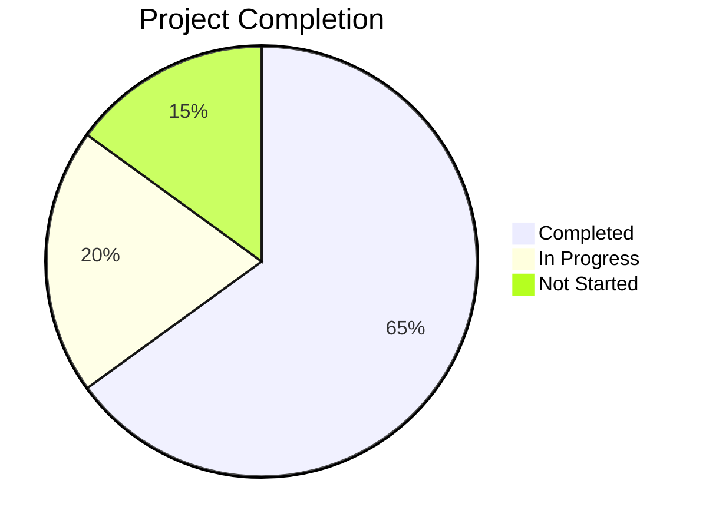

# σ₅: Progress Tracker
*v1.0 | Created: 2025-11-03 | Updated: 2025-11-03*
*Π: DEVELOPMENT | Ω: EXECUTE*

## 📈 Project Status
**Completion: 65%**

### Phase Breakdown
- **Infrastructure**: 95% ✅ (Engines, data, structure complete)
- **Strategy Development**: 40% ⏳ (Barra Elefante implemented, not validated)
- **Pipeline Validation**: 30% ⏳ (Validators exist, orchestration incomplete)
- **MT5 Integration**: 20% 🔜 (Templates ready, generation not tested)
- **Documentation**: 80% ✅ (Comprehensive docs, RIPER initialization in progress)

## ✅ What Works

### [F₁] [✅] Python Backtest Engine
**Status**: Fully implemented and operational
**Components**:
- CLI interface (`mactester.py`)
- Backtest execution (`backtest_engine.py`)
- Parameter optimization (`optimizer.py`)
- Data loading (`data_loader.py`)
- Metrics calculation (`metrics.py`)
- Walk-forward analysis (`walkforward.py`)
- Monte Carlo simulation (`monte_carlo.py`)
- Statistical analysis (`statistical.py`)
- Report generation (`reporter.py`)
- Visualization (`gerar_graficos.py`)

**Notes**: Tested on small datasets, not yet validated on full Golden Data

### [F₂] [✅] Rust Backtest Engine
**Status**: Compiled and ready, not yet fully tested
**Executables**:
- `optimize_batches.exe` - Batch optimization
- `optimize_threads.exe` - Multi-threaded optimization  
- `optimize_standalone.exe` - Single-run optimizer
- `validate_single.exe` - Parameter set validator

**Architecture**: Multi-threaded, modular (backtest_engine, optimizer, metrics, strategy, types)

**Notes**: Compiles successfully, performance testing pending

### [F₃] [✅] Golden Data Repository
**Status**: Complete, 5 years of historical data
**Files**:
- `WINFUT_M5_Golden_Data.csv` (~500 MB)
- `WINFUT_M15_Golden_Data.csv` (~170 MB)
- `metadata.json` (data description)

**Coverage**: 2020-2025, OHLCV + pre-calculated indicators

**Notes**: Immutable, serves as single source of truth

### [F₄] [✅] Barra Elefante Strategy
**Status**: Implemented in Python
**Logic**: Volume breakout detection + elephant candle pattern
**Files**: 
- `strategies/barra_elefante/strategy.py`
- `strategies/barra_elefante/strategy_optimized.py`

**Notes**: Code complete, validation pending

### [F₅] [✅] Project Structure
**Status**: Organized and documented
**Structure**: 
- `engines/` (Python + Rust)
- `strategies/` (modular)
- `data/golden/` (historical data)
- `results/` (output directories)
- `pipeline/` (validation)
- `mt5_integration/` (EA templates)
- `memory-bank/` (RIPER)

**Notes**: Clean separation of concerns, scalable architecture

### [F₆] [✅] Documentation
**Status**: Comprehensive guides and README files
**Files**:
- Main `README.md`
- `ESTRUTURA_COMPLETA.md`
- `docs_mactester/VISAO_GERAL_SISTEMA.md`
- `docs_mactester/WORKFLOW.md`
- Per-component READMEs

**Notes**: Well-documented system, easy onboarding

### [F₇] [✅] Comparison Tools
**Status**: Implemented, not yet executed
**Tools**:
- `pipeline/comparar_mt5_python.py` - MT5 vs Python comparison
- Engine comparison logic (Python vs Rust)

**Notes**: Ready for identity verification tests

## ⏳ What's In Progress

### [F₈] [⏳ 40%] 6-Phase Validation Pipeline
**Status**: Individual validators exist, orchestration incomplete
**Components**:
- Phase 1: Smoke Test (to be tested)
- Phase 2: Mass Optimization (to be tested)
- Phase 3: Walk-Forward (`fase3_walkforward.py`) ✅
- Phase 4: Out-of-Sample (`fase4_out_of_sample.py`) ✅
- Phase 5: Outlier Analysis (`fase5_outlier_analysis.py`) ✅
- Phase 6: Final Report (`fase6_relatorio_final.py`) ✅
- Orchestrator: `run_pipeline.py` (needs testing)

**Next**: Test orchestrator with small dataset [↗️σ₄:N₇]

### [F₉] [⏳ 80%] RIPER Initialization
**Status**: Memory bank files being populated
**Progress**:
- ✅ σ₁: Project Brief (complete)
- ✅ σ₂: System Patterns (complete)
- ✅ σ₃: Technical Context (complete)
- ✅ σ₄: Active Context (complete)
- ⏳ σ₅: Progress Tracker (this file, in progress)
- 🔜 σ₆: Protection Registry (next)
- ✅ Symbol Reference Guide (complete)

**Next**: Complete σ₆, mark initialization done [↗️σ₄:N₁]

### [F₁₀] [⏳ 10%] Identity Verification Workflow
**Status**: Tools ready, execution pending
**Tasks**:
- 🔜 Run Python smoke test (1 day)
- 🔜 Run Rust smoke test (same parameters)
- 🔜 Compare results trade-by-trade
- 🔜 Verify 100% identity
- 🔜 Document any discrepancies

**Blocked By**: RIPER initialization (nearly complete)

**Next**: Execute smoke tests immediately after RIPER complete [↗️σ₄:N₂,N₃,N₄]

### [F₁₁] [⏳ 5%] Strategy Validation
**Status**: Strategy implemented, validation not started
**Tasks**:
- 🔜 Smoke test (1 day, 10 combinations)
- 🔜 Development test (1 week, 100 combinations)
- 🔜 Production test (1 month, 1k combinations)
- 🔜 Full pipeline (3-6 months)

**Next**: Begin with smoke test [↗️σ₄:N₂]

## 🔜 What's Left To Build

### [F₁₂] [🔜] [HIGH] Engine Performance Benchmarking
**Priority**: HIGH
**Description**: Measure and verify Rust is 10-50x faster than Python
**Tasks**:
- Run identical workload on both engines
- Measure execution time, memory usage
- Verify parallelism scaling (multi-core)
- Document performance characteristics

**Depends On**: Identity verification complete
**Timeline**: 1-2 days after identity verification

### [F₁₃] [🔜] [HIGH] Full Pipeline Execution
**Priority**: HIGH  
**Description**: Execute complete 6-phase validation on Barra Elefante
**Tasks**:
- Phase 1: Smoke Test (100-1000 tests)
- Phase 2: Mass Optimization (10k-50k tests)
- Phase 3-6: Walk-Forward, Out-of-Sample, Outlier, Report
- Generate approval/rejection decision

**Depends On**: Strategy smoke test passes, Python == Rust verified
**Timeline**: 1 week (computationally intensive)

### [F₁₄] [🔜] [MEDIUM] MT5 EA Generation & Validation
**Priority**: MEDIUM
**Description**: Generate EA from validated strategy, verify identity with backtest
**Tasks**:
- Generate MQL5 code from approved parameters
- Compile EA in MetaEditor
- Run EA in MT5 Strategy Tester (same period)
- Compare EA results vs Python/Rust (trade-by-trade)
- Fix any discrepancies

**Depends On**: Pipeline approval of strategy
**Timeline**: 2-3 days

### [F₁₅] [🔜] [MEDIUM] Protection System Implementation
**Priority**: MEDIUM
**Description**: Apply Ψ protection markers to critical code sections
**Tasks**:
- Identify critical algorithms (Ψ₁·PROTECTED)
- Mark important functions (Ψ₂·GUARDED)
- Document in σ₆ (protection.md)
- Create pre-commit hooks to warn on protected area changes

**Depends On**: None (can start anytime)
**Timeline**: 1-2 days

### [F₁₆] [🔜] [LOW] Unit Test Expansion
**Priority**: LOW (nice to have)
**Description**: Expand test coverage for Python and Rust engines
**Tasks**:
- Python: `pytest` tests for core modules
- Rust: `cargo test` tests for main functions
- Integration tests for data loading
- Edge case testing

**Depends On**: None
**Timeline**: Ongoing, 1-2 weeks for comprehensive coverage

### [F₁₇] [🔜] [LOW] Second Strategy Development
**Priority**: LOW (future work)
**Description**: Implement second trading strategy to validate modularity
**Tasks**:
- Design new strategy (different from Barra Elefante)
- Implement in `strategies/` folder
- Run through same validation pipeline
- Verify engine/strategy isolation works

**Depends On**: Barra Elefante fully validated
**Timeline**: 2-3 weeks

### [F₁₈] [🔜] [LOW] CI/CD Pipeline
**Priority**: LOW (automation)
**Description**: Automated testing and validation on Git push
**Tasks**:
- GitHub Actions workflow
- Automated Rust compilation check
- Python linting (black, flake8)
- Basic smoke tests on sample data
- Identity verification on PRs

**Depends On**: Test suite expansion
**Timeline**: 1 week

## ⚠️ Known Issues

### [I₁] [⚠️] [MEDIUM] Pipeline Orchestration Untested
**Issue**: `run_pipeline.py` exists but hasn't been run end-to-end
**Impact**: Unknown if all phases integrate correctly
**Workaround**: Test on small dataset first (1 day)
**Priority**: MEDIUM
**Status**: Ready to test after RIPER initialization

### [I₂] [⚠️] [MEDIUM] No Rust Identity Verification Yet
**Issue**: Rust engine compiled but not verified to match Python
**Impact**: Can't trust Rust results for production use yet
**Workaround**: Complete identity verification workflow
**Priority**: MEDIUM (critical for confidence)
**Status**: Next task after RIPER [↗️σ₄:N₄]

### [I₃] [⚠️] [LOW] Large CSV Loading May Be Slow
**Issue**: 670 MB CSV files could have loading overhead
**Impact**: Slower development iteration
**Workaround**: Profile and optimize if needed (Parquet, caching)
**Priority**: LOW (optimize only if becomes bottleneck)
**Status**: Monitoring, no action yet

### [I₄] [⚠️] [LOW] No Type Hints in Python Code
**Issue**: Python codebase lacks comprehensive type annotations
**Impact**: Reduced IDE support, harder to catch type errors
**Workaround**: Add gradually, use `mypy` for validation
**Priority**: LOW (code quality)
**Status**: Future improvement

### [I₅] [⚠️] [LOW] Git History Mixed with Old Docs
**Issue**: Deleted old .cursor/rules and docs/ files show in git status
**Impact**: Confusing git status, dirty working tree
**Workaround**: Commit reorganization properly
**Priority**: LOW (cleanup)
**Status**: User will handle git commit

## 🏁 Milestones

### [M₁] [2025-11-03] [✅] Release 1.0 Structure Complete
**Status**: COMPLETED
**Achievement**: All engines, strategies, data, pipeline structure in place
**Deliverables**:
- Python engine (10 core modules)
- Rust engine (4 compiled binaries)
- Barra Elefante strategy
- Golden Data (5 years)
- Pipeline validators
- Documentation

### [M₂] [2025-11-10] [⏳] RIPER Initialization & Smoke Tests
**Status**: IN PROGRESS (80%)
**Target**: Complete memory bank, run first smoke tests
**Deliverables**:
- σ₁-σ₆ memory files complete
- Python smoke test (1 day)
- Rust smoke test (1 day)
- Identity verification report

### [M₃] [2025-11-30] [🔜] First Strategy Validation (1 Month)
**Status**: NOT STARTED
**Target**: Validate Barra Elefante on 1-month period
**Deliverables**:
- 1-month backtest results
- Python vs Rust comparison
- Initial parameter optimization
- Performance metrics

### [M₄] [2025-12-31] [🔜] Full Pipeline Approval
**Status**: NOT STARTED
**Target**: Complete 6-phase pipeline on 3-6 month period
**Deliverables**:
- All 6 phases executed
- APPROVED or REJECTED decision
- Comprehensive validation report
- Best parameters identified

### [M₅] [2026-01-31] [🔜] EA Generation & MT5 Validation
**Status**: NOT STARTED
**Target**: Generate EA, validate identity with MT5
**Deliverables**:
- MQL5 EA code
- MT5 backtest results
- Python/Rust/MT5 comparison report
- Identity verification (100%)

### [M₆] [2026-03-31] [🔜] Paper Trading Ready
**Status**: NOT STARTED
**Target**: Begin paper trading on demo account
**Deliverables**:
- EA deployed to demo account
- Real-time monitoring setup
- Performance tracking
- 1-2 month demo results

### [M₇] [2026-06-30] [🔜] Live Trading Consideration
**Status**: NOT STARTED
**Target**: Evaluate readiness for live capital deployment
**Deliverables**:
- Paper trading analysis
- Risk assessment
- Capital allocation plan
- Go/No-Go decision

## 📊 Sprint Summary

### Current Sprint: RIPER Initialization
**Duration**: Nov 3, 2025
**Status**: 80% complete

**Completed This Sprint**:
- ✅ Symbol reference guide created
- ✅ σ₁: Project Brief populated
- ✅ σ₂: System Patterns documented
- ✅ σ₃: Technical Context detailed
- ✅ σ₄: Active Context established
- ⏳ σ₅: Progress Tracker (this file)

**Remaining This Sprint**:
- 🔜 σ₆: Protection Registry configuration

**Next Sprint**: Engine Smoke Tests & Identity Verification

## 🎯 Success Metrics

### Correctness
- ✅ Code compiles and runs (Python ✅, Rust ✅)
- 🔜 Python == Rust (100% identity) - **NOT YET VERIFIED**
- 🔜 Python/Rust == MT5 (100% identity) - **NOT YET VERIFIED**

### Performance
- 🔜 Rust 10-50x faster than Python - **NOT YET MEASURED**
- 🔜 Can process 10k+ parameter combinations in reasonable time - **NOT YET TESTED**

### Validation
- 🔜 Strategy passes 3 of 4 pipeline criteria - **NOT YET RUN**
- 🔜 Min 50 trades in test period - **NOT YET VALIDATED**
- 🔜 Sharpe > 0.8 - **NOT YET ACHIEVED**

### Robustness
- 🔜 Walk-Forward: 60%+ windows positive - **NOT YET TESTED**
- 🔜 Out-of-Sample: Min 5 trades, Sharpe > 0.5 - **NOT YET TESTED**
- 🔜 Outlier-resistant: Sharpe > 0.7 without outliers - **NOT YET TESTED**

## 📉 Risk Register

### Risk: Strategy Fails Validation
**Probability**: MEDIUM (40%)
**Impact**: HIGH (must redesign strategy)
**Mitigation**: Start small (smoke test), iterate quickly
**Status**: MONITORING

### Risk: Python/Rust Mismatch
**Probability**: LOW (15%)
**Impact**: HIGH (implementation bug)
**Mitigation**: Thorough comparison tools, trade-by-trade verification
**Status**: PREPARING TO TEST

### Risk: Performance Below Target
**Probability**: LOW (10%)
**Impact**: MEDIUM (slower optimization)
**Mitigation**: Rust is compiled and optimized, should be fast
**Status**: MONITORING

### Risk: MT5 EA Doesn't Match Backtest
**Probability**: MEDIUM (30%)
**Impact**: HIGH (can't trust for live trading)
**Mitigation**: Careful implementation, validation, iteration
**Status**: FUTURE CONCERN

---
*σ₅ tracks project progress and outstanding work*
*[↗️σ₁] for requirements | [↗️σ₄] for current focus | [↗️σ₆] for protected code sections*
