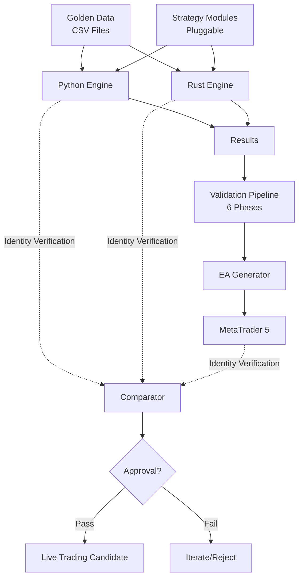

# σ₂: System Patterns
*v1.0 | Created: 2025-11-03 | Updated: 2025-11-03*
*Π: DEVELOPMENT | Ω: EXECUTE*

## 🏛️ Architecture Overview

MacTester follows a **modular, multi-engine architecture** with strict separation of concerns:

## 🧩 Key Components

### Core Engines
- [K₁] **Python Engine** (`engines/python/`): 
  - Purpose: Rapid prototyping, debugging, validation development
  - Entry: `mactester.py` with CLI interface
  - Core modules: backtest_engine, optimizer, data_loader, metrics, walkforward, monte_carlo
  
- [K₂] **Rust Engine** (`engines/rust/`):
  - Purpose: Production-grade performance (10-50x faster), massive parameter sweeps
  - Binaries: optimize_batches, optimize_threads, optimize_standalone, validate_single
  - Architecture: Multi-threaded, zero-copy optimization where possible

### Strategy Layer
- [K₃] **Strategy Modules** (`strategies/`):
  - Purpose: Isolated, pluggable strategy implementations
  - Pattern: Each strategy is self-contained directory with `strategy.py`, `__init__.py`, README
  - Current: Barra Elefante (volume breakout with elephant candle detection)
  - Interface: Standardized signal generation API consumed by engines

### Data Layer
- [K₄] **Golden Data** (`data/golden/`):
  - Purpose: Single source of truth for all backtests
  - Immutable: Never modified, ensures reproducibility
  - Format: CSV with OHLCV + pre-calculated indicators
  - Timeframes: M5 (5-minute), M15 (15-minute)
  - Size: ~670 MB for 5 years

### Validation Pipeline
- [K₅] **6-Phase Pipeline** (`pipeline/`):
  - Purpose: Rigorous statistical validation and overfitting detection
  - Phases: Smoke Test → Mass Optimization → Walk-Forward → Out-of-Sample → Outlier Analysis → Final Report
  - Orchestrator: `run_pipeline.py`
  - Result: APPROVED or REJECTED with detailed metrics

### MT5 Integration
- [K₆] **EA Generator & Validator** (`mt5_integration/`):
  - Purpose: Bridge backtest results to live trading platform
  - Templates: MQL5 EA templates for different strategy patterns
  - Generator: Automatic EA code generation from approved setups
  - Validator: `comparar_mt5_python.py` ensures 100% identity

### Results Storage
- [K₇] **Results Repository** (`results/`):
  - Purpose: Organized storage of all backtest outputs
  - Structure: backtests/{python,rust}, validation/, comparison/{python_vs_rust,python_vs_mt5,rust_vs_mt5}
  - Format: JSON, CSV, plots

## 🧪 Design Patterns

### [P₁] Strategy Pattern - Engine/Strategy Separation
**Context**: Need to test multiple strategies without modifying engine code

**Implementation**:
- Engine provides execution framework (order management, position tracking, metrics)
- Strategy provides signal generation logic only
- Clean interface: `get_signal(candle_data) → BUY/SELL/NONE`

**Benefits**:
- Add new strategies without touching engine
- Same strategy code works with Python AND Rust engines
- Easy A/B testing of strategy variants

### [P₂] Single Source of Truth - Golden Data Pattern
**Context**: Multiple engines must produce identical results

**Implementation**:
- Export complete dataset once from MT5
- Store as immutable "Golden Data"
- All engines read same CSV files
- Never modify original data

**Benefits**:
- Reproducibility guaranteed
- Identity verification possible
- No drift between engines over time

### [P₃] Menor-para-Maior (Small-to-Large) Pattern
**Context**: Testing large periods immediately hides problems and wastes time

**Implementation**:
- Always start with 1 day backtest
- Gradually expand: 1 day → 1 week → 1 month → 3+ months
- Fix issues at small scale before expanding
- Progressive validation builds confidence

**Benefits**:
- Fast debug cycles
- Issues caught early
- Saves computational resources

### [P₄] Multi-Phase Validation Pipeline Pattern
**Context**: Single backtest metric insufficient to detect overfitting

**Implementation**:
- Chain of validators with increasing rigor
- Each phase has pass/fail criteria
- Strategy must pass 3 of 4 key phases
- Automated orchestration via `run_pipeline.py`

**Benefits**:
- Systematic overfitting detection
- Outlier-resistant validation
- Time-series robustness verification

### [P₅] Identity Verification Pattern
**Context**: Must trust that backtest results will materialize in live trading

**Implementation**:
- Python ↔️ Rust: Same parameters → Same results (trade-by-trade)
- Python/Rust ↔️ MT5: Backtest → EA validation (trade-by-trade)
- Automated comparison tools detect any deviation
- Zero tolerance for discrepancies

**Benefits**:
- High confidence in live deployment
- Catches implementation bugs
- Platform-independent validation

## 🔄 Data Flow

```mermaid
flowchart LR
    MT5[MetaTrader 5] -->|Export| GD[Golden Data<br/>CSV]
    GD -->|Load| ENGINE{Choose Engine}
    
    ENGINE -->|Fast Debug| PY[Python Engine]
    ENGINE -->|Production| RUST[Rust Engine]
    
    STRAT[Strategy Module] -->|Signals| PY
    STRAT -->|Signals| RUST
    
    PY -->|Results| RESULTS[Results JSON/CSV]
    RUST -->|Results| RESULTS
    
    RESULTS -->|Best Setups| PIPELINE[Validation Pipeline]
    
    PIPELINE -->|Phase 1| SMOKE[Smoke Test]
    SMOKE -->|Phase 2| MASS[Mass Optimization]
    MASS -->|Phase 3| WF[Walk-Forward]
    WF -->|Phase 4| OOS[Out-of-Sample]
    OOS -->|Phase 5| OUTLIER[Outlier Analysis]
    OUTLIER -->|Phase 6| REPORT[Final Report]
    
    REPORT -->|Approved| EAGEN[EA Generator]
    REPORT -->|Rejected| END[Stop]
    
    EAGEN -->|Generate| EA[Expert Advisor<br/>MQL5]
    EA -->|Deploy| MT5TEST[MT5 Strategy Tester]
    MT5TEST -->|Validate| COMPARE[Compare vs Backtest]
    
    COMPARE -->|Match| LIVE[Live Trading Candidate]
    COMPARE -->|Mismatch| DEBUG[Debug & Fix]
```

## 🔍 Technical Decisions

### [D₁] **Dual-Engine Architecture (Python + Rust)**
**Decision**: Maintain parallel Python and Rust implementations

**Rationale**:
- Python: Faster development, easier debugging, rich scientific libraries
- Rust: 10-50x performance, production-grade reliability, true parallelism
- Best of both worlds: prototype in Python, validate in Rust
- Identity verification acts as integration test suite

**Trade-offs**:
- Increased maintenance (two codebases)
- Benefit outweighs cost: development speed + production performance

[↗️σ₁:R₁] Multi-Engine Architecture requirement

### [D₂] **Immutable Golden Data vs Real-time Feeds**
**Decision**: Use pre-exported historical data, not real-time API

**Rationale**:
- Reproducibility: Same data always gives same results
- Speed: No network latency or rate limits
- Reliability: No API downtime or connection issues
- Completeness: Can include pre-calculated indicators
- Cost: Zero ongoing API costs

**Trade-offs**:
- Manual export process required
- Data becomes stale (re-export periodically)
- For backtesting, benefits strongly outweigh limitations

[↗️σ₁:R₃] Golden Data Foundation requirement

### [D₃] **6-Phase Pipeline vs Simple Optimization**
**Decision**: Implement comprehensive multi-phase validation

**Rationale**:
- Single optimization easily overfits
- Walk-Forward detects temporal robustness
- Out-of-Sample validates on unseen data
- Outlier Analysis prevents lucky extreme trades from masking weak strategy
- Statistical rigor reduces live trading surprises

**Trade-offs**:
- More complex implementation
- Longer validation cycle
- Necessary for professional-grade system

[↗️σ₁:R₄] 6-Phase Validation requirement

### [D₄] **Modular Strategy Architecture vs Monolithic**
**Decision**: Strategies as independent pluggable modules

**Rationale**:
- Engine stability: Never touch engine when adding strategies
- Parallel development: Multiple strategies simultaneously
- Easy testing: Drop-in replacement for A/B testing
- Version control: Each strategy has independent history
- Reusability: Same strategy on different engines

**Trade-offs**:
- Slightly more boilerplate per strategy
- Benefits scale with number of strategies

[↗️σ₁:R₂] Modular Strategy System requirement

### [D₅] **CSV Format vs Database**
**Decision**: Store Golden Data as CSV files, not database

**Rationale**:
- Simplicity: No DB setup, just files
- Portability: Works anywhere, easy backup
- Version control friendly: Can track with Git LFS
- Tool compatibility: Every tool reads CSV
- Performance: Fast enough for this use case (~670 MB loads in seconds)

**Trade-offs**:
- Not suitable for real-time updates
- Less query flexibility
- For historical backtesting, CSV is optimal

### [D₆] **Trade-by-Trade Identity vs Approximate Matching**
**Decision**: Require 100% identical results between engines, zero tolerance for deviation

**Rationale**:
- Any deviation indicates implementation bug
- Approximate matching hides serious errors
- Professional systems require perfection
- Builds absolute confidence for live trading

**Trade-offs**:
- Harder to achieve
- Worth the effort for system integrity

[↗️σ₁:C₁,C₂] Engine Identity success criteria

## 🔗 Component Relationships

### Engine ↔️ Strategy
- **Relationship**: Composition
- **Interface**: Strategy provides `get_signal()`, engine calls it per candle
- **Data flow**: Engine → candle data → Strategy → signal → Engine
- **Coupling**: Loose (strategy knows nothing about engine internals)

### Engine ↔️ Golden Data
- **Relationship**: Data access
- **Interface**: Read-only CSV loading via data_loader
- **Data flow**: Golden Data → Engine buffers → Strategy
- **Coupling**: None (data is passive)

### Python Engine ↔️ Rust Engine
- **Relationship**: Parallel implementation
- **Interface**: Identical CLI parameters and output format
- **Data flow**: Independent execution, results compared post-facto
- **Coupling**: None at runtime, synchronized by design

### Pipeline ↔️ Engines
- **Relationship**: Orchestration
- **Interface**: Pipeline invokes engines via CLI, reads JSON results
- **Data flow**: Pipeline → Engine CLI → Results → Pipeline validators
- **Coupling**: Loose (CLI contract only)

### EA Generator ↔️ Engines
- **Relationship**: Code generation
- **Interface**: Reads approved results, generates MQL5 code
- **Data flow**: Validated results → Template engine → MQL5 EA file
- **Coupling**: Loose (template-based)

### Comparators ↔️ All Engines
- **Relationship**: Validation
- **Interface**: Reads result files from multiple engines
- **Data flow**: Engine results → Comparator → Identity report
- **Coupling**: None (post-processing)

---
*σ₂ captures system architecture and design patterns*
*[↗️σ₁] for requirements | [↗️σ₃] for tech implementation | [↗️σ₄] for active focus*