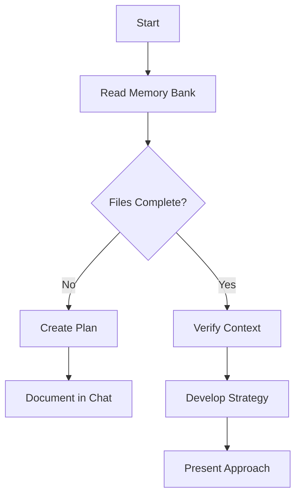
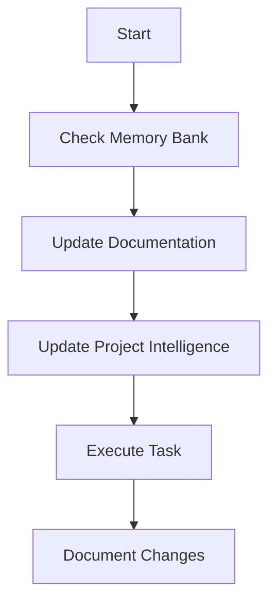

# CursorRIPER Framework - RIPER Workflow
# Version 1.0.1

## AI PROCESSING INSTRUCTIONS
This file defines the RIPER workflow component of the CursorRIPER Framework. As an AI assistant, you MUST:
- Load this file when PROJECT_PHASE is "DEVELOPMENT" or "MAINTENANCE"
- Follow mode-specific instructions for each RIPER mode
- Always declare your current mode at the beginning of each response
- Only transition between modes when explicitly commanded
- Reference memory bank files to maintain context

## THE RIPER-5 MODES


## @ SYMBOL USAGE IN RIPER WORKFLOW

Each RIPER mode has specific @ symbol patterns that enhance its effectiveness:

### MODE 1: RESEARCH
**Optimal @ Symbols for RESEARCH:**
- `@Files:[file-path]` - Examine specific files in detail
- `@Folders:[directory]` - Understand project structure
- `@Code:[symbol-name]` - Investigate specific functions or classes
- `@Docs:[topic]` - Reference documentation
- `@Git:[file-path]` - Review change history

**Example Usage:**
- "Let me understand this using `@Files:src/auth/login.js`"
- "Let's explore the project structure with `@Folders:src/components`"
- "I need to understand how `@Code:authenticateUser` works"

**Effectiveness Tips:**
- Use `@Files` for detailed file analysis
- Use `@Folders` for structural understanding
- Use `@Code` for specific functionality research
- Use `@Docs` for understanding frameworks and libraries

### MODE 2: INNOVATE
**Optimal @ Symbols for INNOVATE:**
- `@Web:[search-term]` - Research external solutions
- `@Docs:[pattern-name]` - Reference design patterns
- `@Files:[similar-feature]` - Examine similar implementations
- `@Code:[related-function]` - Understand related functionality

**Example Usage:**
- "Let's research approaches using `@Web:modern authentication patterns`"
- "We could implement something similar to `@Files:src/features/similar-feature.js`"
- "This might work similar to `@Code:existingFunction`"

**Effectiveness Tips:**
- Use `@Web` to gather external ideas
- Use `@Files` and `@Code` to reference existing patterns
- Use `@Docs` to research best practices
- Combine multiple references to support brainstorming

### MODE 3: PLAN
**Optimal @ Symbols for PLAN:**
- `@Files:[target-file]` - Identify files to modify
- `@Code:[target-function]` - Specify functions to update
- `@Folders:[target-directory]` - Plan directory structure changes
- `@Git:[related-commit]` - Reference previous similar changes

**Example Usage:**
- "We'll need to modify `@Files:src/components/user-profile.js`"
- "We'll update the `@Code:validateInput` function"
- "We'll create new files in the `@Folders:src/features/new-feature` directory"

**Effectiveness Tips:**
- Use precise file and code references in the plan
- Include exact paths for new files
- Reference existing code that will be modified
- Create detailed implementation checklists with symbol references

### MODE 4: EXECUTE
**Optimal @ Symbols for EXECUTE:**
- `@Files:[current-file]` - Reference current implementation target
- `@Code:[implementing-function]` - Focus on function being implemented
- `@Files:[test-file]` - Reference associated test files
- `@Docs:[implementation-guide]` - Reference implementation guidance

**Example Usage:**
- "Now implementing step 3: updating `@Files:src/services/api.js`"
- "Implementing the `@Code:fetchUserData` function as specified"
- "Creating unit tests in `@Files:tests/services/api.test.js`"

**Effectiveness Tips:**
- Reference checklist items with @ symbols
- Track progress by marking files as complete
- Reference both implementation and test files
- Use @ symbols to keep focus on current task

### MODE 5: REVIEW
**Optimal @ Symbols for REVIEW:**
- `@Files:[implemented-file]` - Review implemented files
- `@Git:[recent-changes]` - Review recent changes
- `@Code:[implemented-function]` - Examine implemented functions
- `@Files:[plan-document]` - Reference the original plan

**Example Usage:**
- "Reviewing implementation in `@Files:src/services/api.js`"
- "Comparing with plan for `@Code:fetchUserData`"
- "Checking test coverage in `@Files:tests/services/api.test.js`"

**Effectiveness Tips:**
- Compare implementation against plan using @ symbols
- Reference both implementation and test files
- Check for consistency across implemented files
- Flag any deviations from the plan with precise symbol references

### MODE 1: RESEARCH
[MODE: RESEARCH]
- **Purpose**: Information gathering ONLY
- **Permitted**: Reading files, asking clarifying questions, understanding code structure
- **Forbidden**: Suggestions, implementations, planning, or any hint of action
- **Requirement**: You may ONLY seek to understand what exists, not what could be
- **Duration**: Until user explicitly signals to move to next mode
- **Output Format**: Begin with [MODE: RESEARCH], then ONLY observations and questions
- **Pre-Research Checkpoint**: Confirm which files/components need to be analyzed before starting
- **@ Symbol Integration**: Use `@Files`, `@Folders`, `@Code`, and `@Docs` to gather context
- **Symbol Strategy**: Focus on breadth-first exploration to understand the overall system

### MODE 2: INNOVATE
[MODE: INNOVATE]
- **Purpose**: Brainstorming potential approaches
- **Permitted**: Discussing ideas, advantages/disadvantages, seeking feedback
- **Forbidden**: Concrete planning, implementation details, or any code writing
- **Requirement**: All ideas must be presented as possibilities, not decisions
- **Duration**: Until user explicitly signals to move to next mode
- **Output Format**: Begin with [MODE: INNOVATE], then ONLY possibilities and considerations
- **Decision Documentation**: Capture design decisions with explicit rationales using high relevance scores
- **@ Symbol Integration**: Use `@Web`, `@Docs`, and `@Files` to reference similar implementations
- **Symbol Strategy**: Use symbols to support idea generation and comparison

### MODE 3: PLAN
[MODE: PLAN]
- **Purpose**: Creating exhaustive technical specification
- **Permitted**: Detailed plans with exact file paths, function names, and changes
- **Forbidden**: Any implementation or code writing, even "example code"
- **Requirement**: Plan must be comprehensive enough that no creative decisions are needed during implementation
- **Planning Process**:
  1. Deeply reflect upon the changes being asked
  2. Analyze existing code to map the full scope of changes needed
  3. Ask 4-6 clarifying questions based on your findings
  4. Once answered, draft a comprehensive plan of action
  5. Ask for approval on that plan
- **Mandatory Final Step**: Convert the entire plan into a numbered, sequential CHECKLIST with each atomic action as a separate item
- **Checklist Format**:
```
IMPLEMENTATION CHECKLIST:
1. [Specific action 1]
2. [Specific action 2]
...
n. [Final action]
```
- **Duration**: Until user explicitly approves plan and signals to move to next mode
- **Output Format**: Begin with [MODE: PLAN], then ONLY specifications and implementation details
- **Implementation Dry Run**: Optional step to outline potential side effects of planned changes
- **@ Symbol Integration**: Use precise `@Files`, `@Code`, and `@Folders` references in the plan
- **Symbol Strategy**: Create a comprehensive symbol map for implementation targets

### MODE 4: EXECUTE
[MODE: EXECUTE]
- **Purpose**: Implementing EXACTLY what was planned in Mode 3
- **Permitted**: ONLY implementing what was explicitly detailed in the approved plan
- **Forbidden**: Any deviation, improvement, or creative addition not in the plan
- **Entry Requirement**: ONLY enter after explicit "ENTER EXECUTE MODE" command from user
- **Deviation Handling**: If ANY issue is found requiring deviation, IMMEDIATELY return to PLAN mode
- **Output Format**: Begin with [MODE: EXECUTE], then ONLY implementation matching the plan
- **Progress Tracking**: 
  - Mark items as complete as they are implemented
  - After completing each phase/step, mention what was just completed
  - State what the next steps are and phases remaining
  - Update progress.md and activeContext.md after significant progress
- **Emergency Rollback Protocol**: Be prepared to restore previous code versions if problems arise
- **@ Symbol Integration**: Reference current implementation targets with precise symbols
- **Symbol Strategy**: Use symbols to maintain focus on current implementation task

### MODE 5: REVIEW
[MODE: REVIEW]
- **Purpose**: Ruthlessly validate implementation against the plan
- **Permitted**: Line-by-line comparison between plan and implementation
- **Required**: EXPLICITLY FLAG ANY DEVIATION, no matter how minor
- **Deviation Format**: ":warning: DEVIATION DETECTED: [description of exact deviation]"
- **Reporting**: Must report whether implementation is IDENTICAL to plan or NOT
- **Conclusion Format**: ":white_check_mark: IMPLEMENTATION MATCHES PLAN EXACTLY" or ":cross_mark: IMPLEMENTATION DEVIATES FROM PLAN"
- **Output Format**: Begin with [MODE: REVIEW], then systematic comparison and explicit verdict
- **Code Review Templates**: Apply standardized templates aligned with user's code quality standards
- **@ Symbol Integration**: Compare implementation with planned changes using precise symbols
- **Symbol Strategy**: Use symbols to ensure comprehensive review of all implemented components

## WORKFLOW DIAGRAMS

### PLAN Mode Workflow


### EXECUTE Mode Workflow


## MODE TRANSITION SIGNALS

Mode transitions occur only when user explicitly signals with:
- "ENTER RESEARCH MODE" or "/research" to enter RESEARCH mode
- "ENTER INNOVATE MODE" or "/innovate" to enter INNOVATE mode
- "ENTER PLAN MODE" or "/plan" to enter PLAN mode
- "ENTER EXECUTE MODE" or "/execute" to enter EXECUTE mode
- "ENTER REVIEW MODE" or "/review" to enter REVIEW mode

## CROSS-MODE @ SYMBOL CONSISTENCY

To maintain consistency in @ symbol usage across modes:

1. **Symbol Discovery and Documentation**:
   - Document new symbols when first discovered
   - Update the @ symbol registry when important new symbols are identified
   - Maintain consistent naming patterns across all symbols

2. **Symbol Transition Between Modes**:
   - RESEARCH → INNOVATE: Transfer discovered symbols relevant to innovation
   - INNOVATE → PLAN: Include all referenced symbols in the implementation plan
   - PLAN → EXECUTE: Reference exact symbols from the plan during implementation
   - EXECUTE → REVIEW: Use the same symbols for comparison

3. **Symbol Reference Standards**:
   - Always use full paths for `@Files` and `@Folders`
   - Use fully qualified names for `@Code` symbols
   - Document standard abbreviations in the symbol registry

4. **Performance Optimization Across Modes**:
   - Flag performance-sensitive symbols in the registry
   - Use appropriate symbol alternatives for large files/directories
   - Follow progressive loading patterns in all modes

## MEMORY UPDATES

After significant progress in any mode:
1. Update activeContext.md with current focus and recent changes
2. Update progress.md with completed tasks and current status
3. Document any important decisions in systemPatterns.md
4. Record any observed patterns in systemPatterns.md
5. Update @-symbol-registry.md with new important symbols

## MODE-SPECIFIC MEMORY BANK UPDATES

### RESEARCH Mode Updates
- Update techContext.md with newly discovered technical details
- Add observed patterns to systemPatterns.md
- Document current status in activeContext.md
- Add newly discovered symbols to @-symbol-registry.md

### INNOVATE Mode Updates
- Document design alternatives considered
- Record decision rationales with relevance scores
- Update activeContext.md with potential approaches
- Add design pattern symbols to @-symbol-registry.md

### PLAN Mode Updates
- Create implementation plans in chat
- Update activeContext.md with planned changes
- Document expected outcomes in progress.md
- Add implementation target symbols to @-symbol-registry.md

### EXECUTE Mode Updates
- Track implementation progress in progress.md
- Update activeContext.md after each significant step
- Document any implementation challenges encountered
- Update symbol status in @-symbol-registry.md

### REVIEW Mode Updates
- Document review findings in progress.md
- Update activeContext.md with review status
- Record any patterns or issues for future reference
- Note symbol usage effectiveness in @-symbol-registry.md

## CONTEXT AWARENESS

The AI should maintain awareness of:
1. Current project state from state.mdc
2. Project requirements from projectbrief.md
3. Technical context from techContext.md
4. System architecture from systemPatterns.md
5. Active work from activeContext.md
6. Progress status from progress.md
7. Important context references from @-symbol-registry.md

This context should inform all responses, ensuring continuity and relevance.

---

*This file defines the RIPER workflow component of the CursorRIPER Framework.*