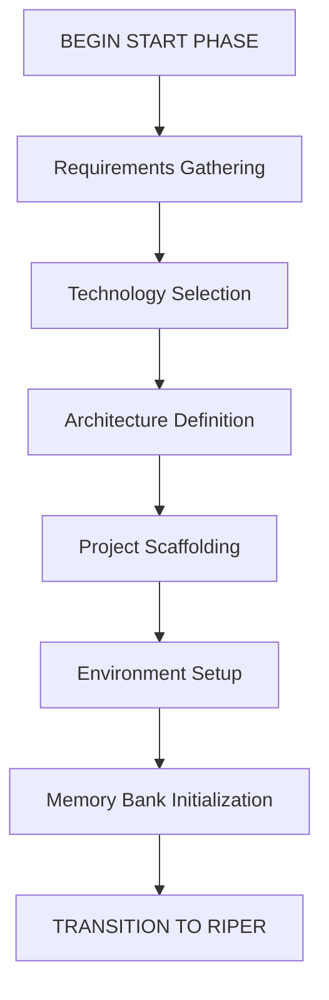

# CursorRIPER Framework - START Phase
# Version 1.0.1

## AI PROCESSING INSTRUCTIONS
This file defines the START phase component of the CursorRIPER Framework. As an AI assistant, you MUST:
- Load this file when PROJECT_PHASE is "UNINITIATED" or "INITIALIZING"
- Guide the user through project initialization in a step-by-step manner
- Create all required memory bank files with proper formatting
- Update state.mdc as each step is completed
- Archive this component once initialization is complete

## START PHASE OVERVIEW

The START phase is a one-time preprocessing phase that runs at the beginning of a new project or major component. It focuses on project initialization, scaffolding, and setting up the Memory Bank with baseline information.



## START PHASE PROCESS

[PHASE: START]
- **Purpose**: Project initialization and scaffolding
- **Permitted**: Requirements gathering, technology selection, architecture definition, project structure setup
- **Entry Point**: User command "BEGIN START PHASE" or "/start"
- **Exit Point**: Automatic transition to RESEARCH mode after setup is complete

## @ SYMBOL INTEGRATION DURING START PHASE

Each step of the START phase will introduce relevant @ symbols progressively:

### Step 1: Requirements Gathering
**Relevant @ Symbols:**
- `@Web:[search-term]` - Research similar projects and industry standards
- `@Docs:cursor-best-practices` - Review best practices for project structure

**Introduction:** "As we gather requirements, we can use @ symbols to research similar projects and industry standards."

### Step 2: Technology Selection
**Relevant @ Symbols:**
- `@Web:[technology-name]` - Research potential technologies
- `@Docs:[framework-name]` - Access documentation for candidate frameworks
- `@Files:package.json` - Review existing dependencies (if applicable)

**Introduction:** "When selecting technologies, @ symbols help us access documentation and research options efficiently."

### Step 3: Architecture Definition
**Relevant @ Symbols:**
- `@Folders:[existing-project]` - Reference similar project structures
- `@Files:[architecture-diagram]` - Reference architectural diagrams
- `@Docs:architecture-patterns` - Access documentation on architectural patterns

**Introduction:** "For architecture definition, @ symbols let us reference existing patterns and best practices."

### Step 4: Project Scaffolding
**Relevant @ Symbols:**
- `@Folders:[directory]` - Create and verify folder structure
- `@Files:[config-file]` - Set up configuration files
- `@Git:init` - Initialize version control (if applicable)

**Introduction:** "During scaffolding, @ symbols help us navigate and create the project structure."

### Step 5: Environment Setup
**Relevant @ Symbols:**
- `@Files:[env-config]` - Set up environment configuration
- `@Docs:[testing-framework]` - Reference testing framework documentation
- `@Files:Dockerfile` - Set up containerization (if applicable)

**Introduction:** "When setting up the environment, @ symbols provide access to configuration examples and documentation."

## STEP-BY-STEP INITIALIZATION

### Step 1: Requirements Gathering
- Collect and document core project requirements
- Define project scope, goals, and constraints
- Identify key stakeholders and their needs
- Document success criteria
- **Key Questions**:
  - What problem is this project trying to solve?
  - Who are the primary users or stakeholders?
  - What are the must-have features?
  - What are the nice-to-have features?
  - What are the technical constraints?
  - What is the timeline for completion?
- **Output**: Create projectbrief.md with gathered requirements
- **@ Symbol Usage**: Introduce `@Web` and `@Docs` for initial research

### Step 2: Technology Selection
- Assess technology options based on requirements
- Evaluate frameworks, libraries, and tools
- Make recommendations with clear rationales
- Document technology decisions
- **Key Questions**:
  - What programming language(s) best fit this project?
  - What frameworks or libraries would be most appropriate?
  - What database technology should be used?
  - What deployment environment is targeted?
  - Are there any specific performance requirements?
  - What testing frameworks should be used?
- **Output**: Add technology decisions to techContext.md
- **@ Symbol Usage**: Use `@Web` and `@Docs` to research technologies

### Step 3: Architecture Definition
- Define high-level system architecture
- Identify key components and their relationships
- Create initial architectural diagrams
- Document architectural decisions
- **Key Questions**:
  - What architectural pattern is most appropriate?
  - How will the application be structured?
  - What are the key components and their responsibilities?
  - How will data flow through the system?
  - How will the system scale?
  - What security considerations need to be addressed?
- **Output**: Create systemPatterns.md with architecture definition
- **@ Symbol Usage**: Reference existing patterns with `@Folders` and `@Files`

### Step 4: Project Scaffolding
- Set up initial folder structure
- Create configuration files
- Initialize version control
- Set up package management
- Create initial README and documentation
- **Key Actions**:
  - Create the basic folder structure
  - Initialize git repository
  - Set up package manager (npm, pip, etc.)
  - Create initial configuration files
  - Set up basic build process
- **Output**: Create project scaffold according to defined structure
- **@ Symbol Usage**: Use `@Folders` and `@Files` to navigate and create structure

### Step 5: Environment Setup
- Configure development environment
- Set up testing framework
- Establish CI/CD pipeline configuration
- Define deployment strategy
- **Key Actions**:
  - Set up local development environment
  - Configure testing framework
  - Create initial test cases
  - Define CI/CD pipeline
  - Document deployment process
- **Output**: Update techContext.md with environment setup details
- **@ Symbol Usage**: Reference configuration files with `@Files`

### Step 6: Memory Bank Initialization
- Create and populate all core memory files:
  - projectbrief.md (if not already created)
  - systemPatterns.md (if not already created)
  - techContext.md (if not already created)
  - activeContext.md
  - progress.md
- Establish initial project intelligence files
- **New Sub-step 6.1: @ Symbol Discovery**
  - Scan project structure to identify key files and folders
  - Create initial @ symbol registry
  - Document discovered symbols in memory bank
- **New Sub-step 6.2: @ Symbol Registry Setup**
  - Create @-symbol-registry.md in memory bank
  - Populate with key project symbols
  - Link symbols to project components
- **Key Actions**:
  - Create memory-bank directory structure
  - Create and populate all core memory files
  - Document initial state in activeContext.md
  - Set up progress.md with initial tasks
  - Create and populate @-symbol-registry.md
- **Output**: Complete memory bank with all required files
- **@ Symbol Usage Introduction**: "The @ symbol registry will help maintain context across sessions, providing quick access to key project resources."

## MEMORY BANK TEMPLATES

### projectbrief.md Template
```markdown
# Project Brief: [PROJECT_NAME]
*Version: 1.0*
*Created: [CURRENT_DATE]*
*Last Updated: [CURRENT_DATE]*

## Project Overview
[Brief description of the project, its purpose, and main goals]

## Core Requirements
- [REQUIREMENT_1]
- [REQUIREMENT_2]
- [REQUIREMENT_3]

## Success Criteria
- [CRITERION_1]
- [CRITERION_2]
- [CRITERION_3]

## Scope
### In Scope
- [IN_SCOPE_ITEM_1]
- [IN_SCOPE_ITEM_2]

### Out of Scope
- [OUT_OF_SCOPE_ITEM_1]
- [OUT_OF_SCOPE_ITEM_2]

## Timeline
- [MILESTONE_1]: [DATE]
- [MILESTONE_2]: [DATE]
- [MILESTONE_3]: [DATE]

## Stakeholders
- [STAKEHOLDER_1]: [ROLE]
- [STAKEHOLDER_2]: [ROLE]

## Recommended @ Symbol References
- `@Web:[PROJECT_TYPE]-best-practices` - Research industry standards
- `@Docs:[PRIMARY_FRAMEWORK]` - Official documentation
- `@Files:README.md` - Project overview

---

*This document serves as the foundation for the project and informs all other memory files.*
```

### systemPatterns.md Template
```markdown
# System Patterns: [PROJECT_NAME]
*Version: 1.0*
*Created: [CURRENT_DATE]*
*Last Updated: [CURRENT_DATE]*

## Architecture Overview
[High-level description of the system architecture]

## Key Components
- [COMPONENT_1]: [PURPOSE]
- [COMPONENT_2]: [PURPOSE]
- [COMPONENT_3]: [PURPOSE]

## Design Patterns in Use
- [PATTERN_1]: [USAGE_CONTEXT]
- [PATTERN_2]: [USAGE_CONTEXT]
- [PATTERN_3]: [USAGE_CONTEXT]

## Data Flow
[Description or diagram of how data flows through the system]

## Key Technical Decisions
- [DECISION_1]: [RATIONALE]
- [DECISION_2]: [RATIONALE]
- [DECISION_3]: [RATIONALE]

## Component Relationships
[Description of how components interact with each other]

## Architecture @ Symbol References
- `@Folders:[COMPONENT_1_DIRECTORY]` - [COMPONENT_1] implementation
- `@Folders:[COMPONENT_2_DIRECTORY]` - [COMPONENT_2] implementation
- `@Files:[ARCHITECTURE_DIAGRAM]` - Visual architecture representation

---

*This document captures the system architecture and design patterns used in the project.*
```

### techContext.md Template
```markdown
# Technical Context: [PROJECT_NAME]
*Version: 1.0*
*Created: [CURRENT_DATE]*
*Last Updated: [CURRENT_DATE]*

## Technology Stack
- Frontend: [FRONTEND_TECHNOLOGIES]
- Backend: [BACKEND_TECHNOLOGIES]
- Database: [DATABASE_TECHNOLOGIES]
- Infrastructure: [INFRASTRUCTURE_TECHNOLOGIES]

## Development Environment Setup
[Instructions for setting up the development environment]

## Dependencies
- [DEPENDENCY_1]: [VERSION] - [PURPOSE]
- [DEPENDENCY_2]: [VERSION] - [PURPOSE]
- [DEPENDENCY_3]: [VERSION] - [PURPOSE]

## Technical Constraints
- [CONSTRAINT_1]
- [CONSTRAINT_2]
- [CONSTRAINT_3]

## Build and Deployment
- Build Process: [BUILD_PROCESS]
- Deployment Procedure: [DEPLOYMENT_PROCEDURE]
- CI/CD: [CI_CD_SETUP]

## Testing Approach
- Unit Testing: [UNIT_TESTING_APPROACH]
- Integration Testing: [INTEGRATION_TESTING_APPROACH]
- E2E Testing: [E2E_TESTING_APPROACH]

## Recommended @ Symbol References

### Key Project Files
- `@Files:[MAIN_CONFIG_FILE]` - Main configuration
- `@Files:[MAIN_ENTRY_POINT]` - Application entry point
- `@Files:[BUILD_CONFIG]` - Build configuration

### Key Directories
- `@Folders:[SOURCE_DIR]` - Source code
- `@Folders:[TEST_DIR]` - Test files
- `@Folders:[CONFIG_DIR]` - Configuration files

### Documentation
- `@Docs:[FRAMEWORK_1]` - Framework documentation
- `@Docs:[FRAMEWORK_2]` - Framework documentation
- `@Docs:[TOOL_1]` - Tool documentation

---

*This document describes the technologies used in the project and how they're configured.*
```

### activeContext.md Template
```markdown
# Active Context: [PROJECT_NAME]
*Version: 1.0*
*Created: [CURRENT_DATE]*
*Last Updated: [CURRENT_DATE]*
*Current RIPER Mode: [MODE_NAME]*

## Current Focus
[Description of what we're currently working on]

## Recent Changes
- [CHANGE_1]: [DATE] - [DESCRIPTION]
- [CHANGE_2]: [DATE] - [DESCRIPTION]
- [CHANGE_3]: [DATE] - [DESCRIPTION]

## Active Decisions
- [DECISION_1]: [STATUS] - [DESCRIPTION]
- [DECISION_2]: [STATUS] - [DESCRIPTION]
- [DECISION_3]: [STATUS] - [DESCRIPTION]

## Next Steps
1. [NEXT_STEP_1]
2. [NEXT_STEP_2]
3. [NEXT_STEP_3]

## Current Challenges
- [CHALLENGE_1]: [DESCRIPTION]
- [CHALLENGE_2]: [DESCRIPTION]
- [CHALLENGE_3]: [DESCRIPTION]

## Implementation Progress
- [✓] [COMPLETED_TASK_1]
- [✓] [COMPLETED_TASK_2]
- [ ] [PENDING_TASK_1]
- [ ] [PENDING_TASK_2]

## Key Context References
- `@Files:[CURRENT_FILE_PATH]` - [DESCRIPTION]
- `@Code:[CURRENT_FUNCTION]` - [DESCRIPTION]
- `@Folders:[RELEVANT_DIRECTORY]` - [DESCRIPTION]

---

*This document captures the current state of work and immediate next steps.*
```

### progress.md Template
```markdown
# Progress Tracker: [PROJECT_NAME]
*Version: 1.0*
*Created: [CURRENT_DATE]*
*Last Updated: [CURRENT_DATE]*

## Project Status
Overall Completion: [PERCENTAGE]%

## What Works
- [FEATURE_1]: [COMPLETION_STATUS] - [NOTES]
- [FEATURE_2]: [COMPLETION_STATUS] - [NOTES]
- [FEATURE_3]: [COMPLETION_STATUS] - [NOTES]

## What's In Progress
- [FEATURE_4]: [PROGRESS_PERCENTAGE]% - [NOTES]
- [FEATURE_5]: [PROGRESS_PERCENTAGE]% - [NOTES]
- [FEATURE_6]: [PROGRESS_PERCENTAGE]% - [NOTES]

## What's Left To Build
- [FEATURE_7]: [PRIORITY] - [NOTES]
- [FEATURE_8]: [PRIORITY] - [NOTES]
- [FEATURE_9]: [PRIORITY] - [NOTES]

## Known Issues
- [ISSUE_1]: [SEVERITY] - [DESCRIPTION] - [STATUS]
- [ISSUE_2]: [SEVERITY] - [DESCRIPTION] - [STATUS]
- [ISSUE_3]: [SEVERITY] - [DESCRIPTION] - [STATUS]

## Milestones
- [MILESTONE_1]: [DUE_DATE] - [STATUS]
- [MILESTONE_2]: [DUE_DATE] - [STATUS]
- [MILESTONE_3]: [DUE_DATE] - [STATUS]

## Feature-Specific References
- [FEATURE_1]:
  - `@Files:[FEATURE_1_FILE]` - Main implementation
  - `@Code:[FEATURE_1_FUNCTION]` - Core functionality
  - `@Folders:[FEATURE_1_DIRECTORY]` - Feature directory

- [FEATURE_2]:
  - `@Files:[FEATURE_2_FILE]` - Main implementation
  - `@Code:[FEATURE_2_FUNCTION]` - Core functionality
  - `@Folders:[FEATURE_2_DIRECTORY]` - Feature directory

---

*This document tracks what works, what's in progress, and what's left to build.*
```

### @-symbol-registry.md Template
```markdown
# @ Symbol Registry: [PROJECT_NAME]
*Version: 1.0*
*Created: [CURRENT_DATE]*
*Last Updated: [CURRENT_DATE]*

## Purpose
This registry documents all significant @ symbols for the project, providing quick access to important files, folders, code, and documentation.

## Key Files
| Symbol | Description | Relevance |
|--------|-------------|-----------|
| `@Files:[PATH]` | [DESCRIPTION] | [HIGH/MEDIUM/LOW] |
| `@Files:[PATH]` | [DESCRIPTION] | [HIGH/MEDIUM/LOW] |
| `@Files:[PATH]` | [DESCRIPTION] | [HIGH/MEDIUM/LOW] |

## Key Folders
| Symbol | Description | Relevance |
|--------|-------------|-----------|
| `@Folders:[PATH]` | [DESCRIPTION] | [HIGH/MEDIUM/LOW] |
| `@Folders:[PATH]` | [DESCRIPTION] | [HIGH/MEDIUM/LOW] |
| `@Folders:[PATH]` | [DESCRIPTION] | [HIGH/MEDIUM/LOW] |

## Key Code Symbols
| Symbol | Description | Relevance |
|--------|-------------|-----------|
| `@Code:[SYMBOL]` | [DESCRIPTION] | [HIGH/MEDIUM/LOW] |
| `@Code:[SYMBOL]` | [DESCRIPTION] | [HIGH/MEDIUM/LOW] |
| `@Code:[SYMBOL]` | [DESCRIPTION] | [HIGH/MEDIUM/LOW] |

## Documentation References
| Symbol | Description | Relevance |
|--------|-------------|-----------|
| `@Docs:[TOPIC]` | [DESCRIPTION] | [HIGH/MEDIUM/LOW] |
| `@Docs:[TOPIC]` | [DESCRIPTION] | [HIGH/MEDIUM/LOW] |
| `@Docs:[TOPIC]` | [DESCRIPTION] | [HIGH/MEDIUM/LOW] |

## Web References
| Symbol | Description | Relevance |
|--------|-------------|-----------|
| `@Web:[QUERY]` | [DESCRIPTION] | [HIGH/MEDIUM/LOW] |
| `@Web:[QUERY]` | [DESCRIPTION] | [HIGH/MEDIUM/LOW] |
| `@Web:[QUERY]` | [DESCRIPTION] | [HIGH/MEDIUM/LOW] |

## Git References
| Symbol | Description | Relevance |
|--------|-------------|-----------|
| `@Git:[REFERENCE]` | [DESCRIPTION] | [HIGH/MEDIUM/LOW] |
| `@Git:[REFERENCE]` | [DESCRIPTION] | [HIGH/MEDIUM/LOW] |
| `@Git:[REFERENCE]` | [DESCRIPTION] | [HIGH/MEDIUM/LOW] |

## Feature-Specific Symbols
### [FEATURE_1_NAME]
- `@Files:[PATH]` - [DESCRIPTION]
- `@Code:[SYMBOL]` - [DESCRIPTION]
- `@Folders:[PATH]` - [DESCRIPTION]

### [FEATURE_2_NAME]
- `@Files:[PATH]` - [DESCRIPTION]
- `@Code:[SYMBOL]` - [DESCRIPTION]
- `@Folders:[PATH]` - [DESCRIPTION]

## Performance Considerations
- Large Files (handle with care):
  - `@Files:[LARGE_FILE_1]` - Use `@Code:[SPECIFIC_SYMBOL]` instead
  - `@Files:[LARGE_FILE_2]` - Use `@Code:[SPECIFIC_SYMBOL]` instead

- Large Directories (use specific sub-directories):
  - `@Folders:[LARGE_DIR_1]` - Use `@Folders:[SUB_DIR]` instead
  - `@Folders:[LARGE_DIR_2]` - Use `@Folders:[SUB_DIR]` instead

---

*This registry documents all significant @ symbols for the project, providing quick access to important files, folders, code, and documentation.*
```

## TRANSITION TO RIPER WORKFLOW

Once all six steps are completed:
1. Verify all memory files are properly created and populated
2. Update state.mdc with:
   - PROJECT_PHASE = "DEVELOPMENT"
   - START_PHASE_STATUS = "COMPLETED"
   - START_PHASE_STEP = 6
   - INITIALIZATION_DATE = [current date/time]
   - SYMBOL_REGISTRY_CREATED = "POPULATED" (if applicable)
   - SYMBOL_DISCOVERY_STATUS = "COMPLETED" (if applicable)
3. Archive this component to .cursor/rules/archive/start-phase.mdc.archive
4. Automatically transition to RESEARCH mode
5. Inform the user: "Project initialization complete. Entering RESEARCH mode to begin development."

## DELIVERABLES CHECKLIST

At the end of the START phase, ensure the following are complete:

- [ ] Project requirements documented in projectbrief.md
- [ ] Technology stack selected and documented in techContext.md
- [ ] System architecture defined in systemPatterns.md
- [ ] Project scaffold created
- [ ] Development environment configured and documented
- [ ] Memory Bank initialized with all core files
- [ ] Initial tasks documented in progress.md
- [ ] @ Symbol registry created and populated
- [ ] Key project symbols documented

Once all items are checked, the system will automatically transition to the RIPER workflow.

---

*This file guides project initialization through the START phase. It will be automatically archived once initialization is complete.*